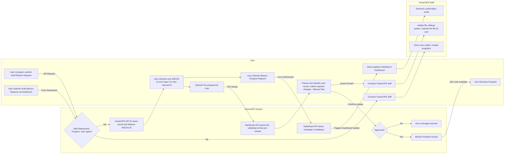
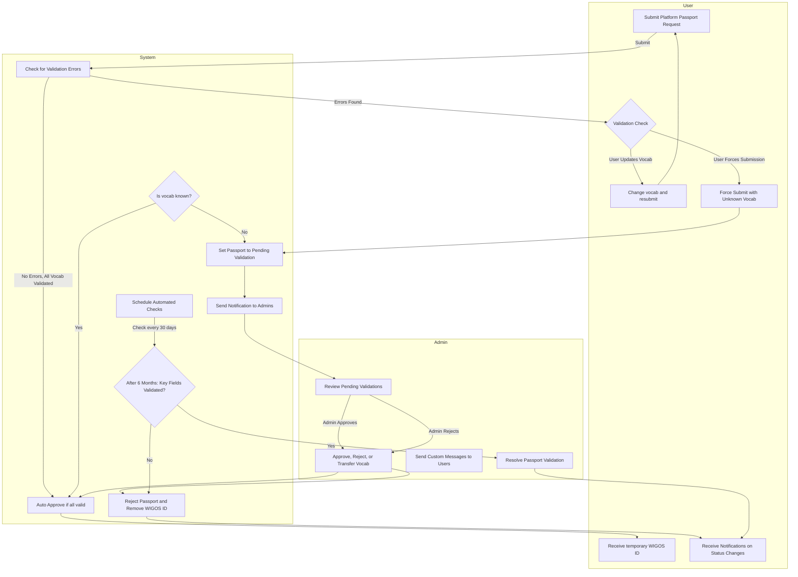

# Passport Request System

## ClickUp Tickets

- [ClickUp Ticket 1](https://app.clickup.com/t/86989z52j)
- [ClickUp Ticket 2](https://app.clickup.com/t/86989z6e9)
- [ClickUp Ticket 3](https://app.clickup.com/t/86989z730)
- [ClickUp Ticket 4](https://app.clickup.com/t/86989z756)
- [ClickUp Ticket 5](https://app.clickup.com/t/86989z78d)
- [ClickUp Ticket 6](https://app.clickup.com/t/86989z7gd)
- [ClickUp Ticket 7](https://app.clickup.com/t/86989z7xc)
- [ClickUp Ticket 8](https://app.clickup.com/t/86989z8n6)
- [ClickUp Ticket 9](https://app.clickup.com/t/86989zfy9)

## Passport Request Rules

- Allow vocab generation without barriers for Ship, Sensor models, Platform models, and Programs.
- As long as one vocab is still pending validation, then the passport is also in a "Pending validation" status.
- This status is also applied to passports if any key metadata required for passport are missing.

## Schema Changes

### Mission
- **passportStatus** (enum: "Not requested", "Pending validation", "Approved", "Rejected")
- **passportRequestDate** (date) - Date WIGOS-ID is temporarily attributed to Ptf
- **passportApplicant** (contact)

### Ship, Sensor Model, Program, and Platform Model
- **validated** (boolean) - Indicates whether the vocab has been validated.

## Automatic Passport Rejection
- If a mission has missing or unvalidated key attributes, the passport application is automatically declined after six months and WIGOS-ID is removed from the mission.

## Alerts & Notifications

### Notifications to System Admins
- When a new vocab needs validation.
- 60 days and 40 days before a platform pending validation with unvalidated vocab is to be rejected.

### Notifications to Passport Applicants
- When they submit a platform application with unknown vocab pending validation.
- When they submit vocab that requires additional details before validation.
- 30 and 10 days before their platform application is to be rejected.
- When a vocab they requested is rejected, approved, or transferred to existing vocab.

## User Interface (UI) Development

- Develop a UI to show vocab pending validation in each of the 4 classes.
- Develop a GUI for admins to handle validations efficiently:
  - Quickly check for similar existing items.
  - Approve, reject, transfer buttons.
  - Contact user button with pre-written message options.
- External users can log in to complete missing vocab information (e.g., if an unknown sensor model name was force submitted for a platform, the user can provide a description and details here).

## User Journey

1. **Pre-submission Validation**
   - User's machine validates request and returns errors, unknown vocab, and suggestions.
   - User chooses to either change unknown vocab and try again or force submission of unknown vocab.
2. **Temporary WIGOS-ID Assignment**
   - The machine adds the permission record and delivers a WIGOS-ID on a temporary basis.
   - If all requirements are met, the passport is automatically approved.
   - If unknown vocab is present, the passport status is set to "Pending validation."
3. **Admin Notifications & Processing**
   - Admins receive notifications for vocab pending validation.
   - They connect to the GUI to manage validations.
4. **User Updates**
   - Users receive notifications on passport updates and vocab validations.

## Existing Workflow for platform submission (Mermaid Diagram)

## Future Workflow (Mermaid Diagram)

